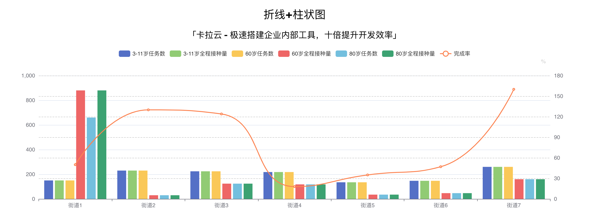

# React Echarts 使用教程 - 如何在 React 中加入图表（内附数据看板实战搭建案例）

本教程配套文章请访问卡拉云技术博客：《[React Echarts 使用教程 - 如何在 React 中加入图表（内附数据看板实战搭建案例）](https://kalacloud.com/blog/react-echarts-tutorial/)》

Ehcarts 作为数据展示的组件，应用场景丰富，所以在 [React 里引入 Echarts 图表](https://kalacloud.com/blog/react-echarts-tutorial/)是每个前端必会技能。而 `Echarts`配置项多且复杂，每个配置项都会细分很多个配置小项，并且还对外暴露了一套 API，包括图表实例，事件监听等，还是有一定的上手难度。

本文手把手教大家如何在 `React` 里使用 `Echarts`，并结合实际使用场景，分享我是如何处理图表自适应等具体问题。

DEMO 演示：[https://my.kalacloud.com/apps/1zy4x4kwxm/published](https://my.kalacloud.com/apps/1zy4x4kwxm/published)